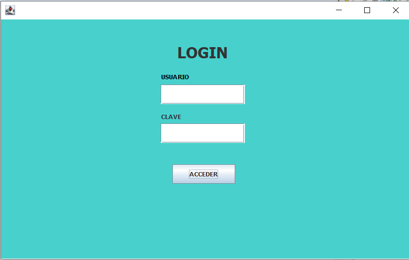
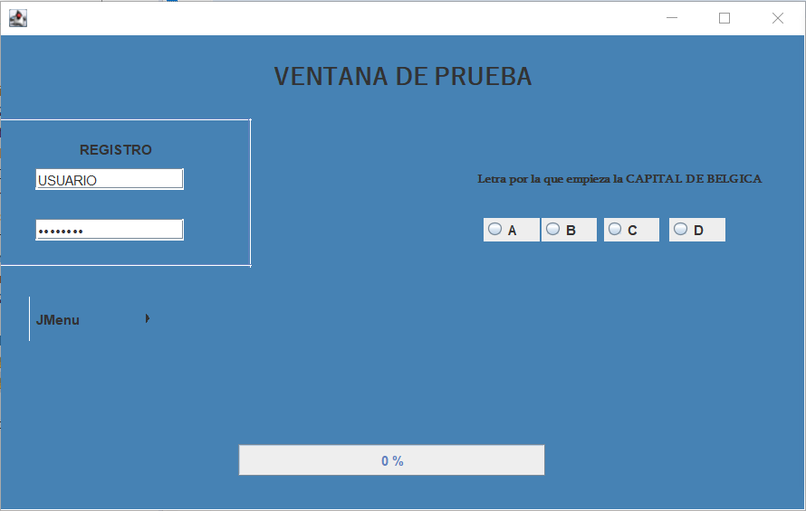

# PracticaVentanaSimple

**Version 1.0.3**
---
Pruebas usando [JAVA](https://www.java.com/es/)

Un ejemplo de:
1) Una ventana simple
2) Una ventana Login 
--- 
# FOTOS
## VENTANA LOGIN

---
## VENTANA SIMPLE

---
## TO DO

- [ ] Conectar Ventanas
- [ ] Mejorar Interfaz de Ventanas
- [ ] Añadir Usuarios
- [ ] Añadir parte administrador

---

## Contributors

- Jon Ibarreche <jon.ibarreche@opendeusto.es>
---
